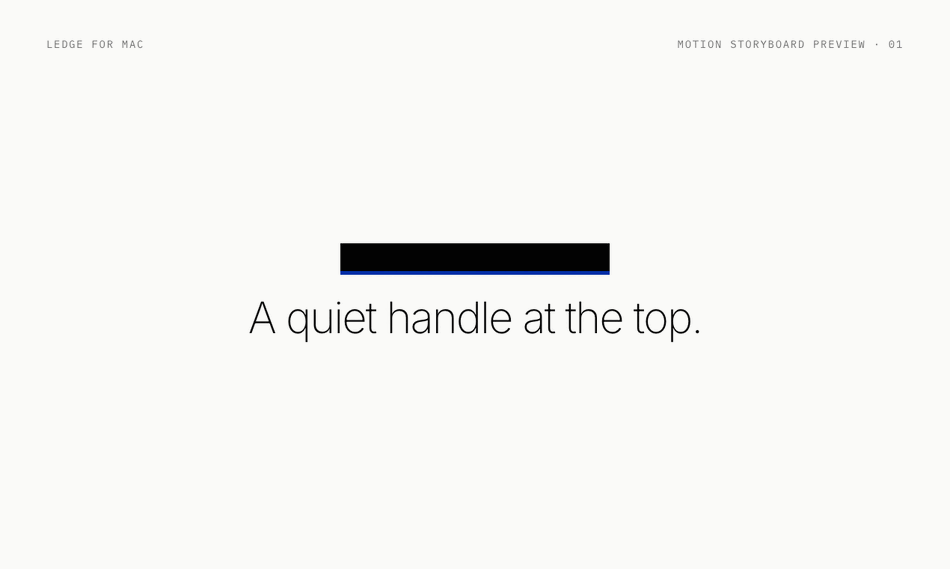

<div align="center">

# Ledge · 纳岛

**Your MacBook's notch, turned into a shelf.**
Drop files, screenshots, links — even windows. Grab them back whenever.

[](https://github.com/DHLbigmonster/ledge/releases/latest)
[](https://github.com/DHLbigmonster/ledge/releases)
[](https://github.com/DHLbigmonster/ledge/releases/latest)



[Download](https://github.com/DHLbigmonster/ledge/releases/latest) · [Website](https://dhlbigmonster.github.io/ledge/) · [Report an issue](https://github.com/DHLbigmonster/ledge/issues)

</div>

---

## Why Ledge

Your desktop is not a storage system. Ledge lives in the notch — hover, drop, done. Everything stays on your Mac, exactly where you left it, until you need it again.

- 📥 **Drop anything** — files, images, links, text. Drag them in, or just press `⌘V`.
- 🪟 **Stash windows** — park any app window into the island with a shortcut, jump straight back to it later. Perfect for background AI agents and chat windows.
- 🗂 **Batch stacking** — drop several items at once and they stack into one tidy pile. Tap to fan them out, drag one out, or move the whole stack.
- 📤 **AirDrop zone** — drag any item onto the AirDrop zone and it sends. No Finder, no Share menu.
- 📋 **Clipboard capture** — screenshots and copied text can land on the shelf automatically (optional, off by default for text).
- ⚡️ **Your shortcuts** — every hotkey is remappable in Settings.
- 🖥 **Notch or no notch** — melts into the notch on notched MacBooks; becomes a slim Top Handle on notchless Macs, Intel included. One universal build.
- 🔒 **100% local** — no account, no cloud, no analytics. Your items never leave your Mac.

## Installation

**System requirements:** macOS 14 Sonoma or later · Apple Silicon or Intel (one universal build)

1. Download `Ledge.dmg` from the [latest release](https://github.com/DHLbigmonster/ledge/releases/latest).
2. Open the DMG and drag **Ledge** into `/Applications`.
3. First launch: macOS will warn that Ledge is from an unidentified developer — expected, the app is not notarized. Bypass it once, either way:

   **Terminal (always works):**
   ```bash
   xattr -dr com.apple.quarantine /Applications/Ledge.app
   ```
   **Or System Settings:** try to open the app → dismiss the warning → *System Settings → Privacy & Security* → scroll down → **Open Anyway**.

4. Optional: for **window stashing**, grant Accessibility access when prompted (*System Settings → Privacy & Security → Accessibility*).

Ledge updates itself automatically in the background — no need to re-download.

## Usage

1. Launch Ledge — the notch is now alive.
2. **Hover** over the notch to open the shelf.
3. **Drop** files, images, links or text onto it — or press `⌘V` while it's open to paste from the clipboard.
4. **Hover** an item to preview, **double-click** to open, **right-click** for Copy / Open / AirDrop / Delete.
5. **Drag** an item out to wherever you need it — Finder, a chat box, a browser.

### Default shortcuts

| Action | Shortcut |
| --- | --- |
| Show / hide the island | `⌥ Space` |
| Stash the front window | `⌃ ⌥ L` |
| Jump back to a stashed window | `⌃ ⌥ ⇧ L` |
| Paste clipboard into the island | `⌘ V` (while open) |
| Delete hovered item | `⌘ ⌫` (while open) |
| Close the island | `Esc` |

All remappable in **Settings** (gear icon, top-left of the island).

## FAQ

**Does anything leave my Mac?**
No. Ledge has no account system, no cloud sync, no analytics. The only network request it ever makes is checking for app updates.

**Why does window stashing need Accessibility access?**
macOS requires it to move and resize other apps' windows. Everything else in Ledge works without it.

**Intel Mac? No notch?**
Same download. Ledge detects your screen and shows a slim Top Handle instead — hover it and it opens just the same.

**Where are my items stored?**
In `~/Library/Application Support/Ledge`. Files are referenced in place — Ledge never copies or uploads them.

## Feedback

Found a bug? Have an idea? [Open an issue](https://github.com/DHLbigmonster/ledge/issues) — every report gets read.

---

<details>
<summary>中文简介</summary>

纳岛（Ledge）把 MacBook 的刘海变成一个本地收纳架：文件、截图、链接、窗口都能拖进去，随时取回。支持批量堆叠、隔空投送专区、剪贴板捕获、自定义快捷键，纯本地运行、无任何账号与网络依赖。没有刘海的 Mac（含 Intel）会自动变成顶部细条，同一安装包通用。

</details>

<details>
<summary>Website development · 官网开发</summary>

This repository also hosts the Ledge website (GitHub Pages).

```bash
npm install
npm run dev     # local dev
npm run lint    # pre-release check
npm run build   # outputs dist/ for GitHub Pages
```

Built with Vite, React, TypeScript and Tailwind CSS.

</details>
